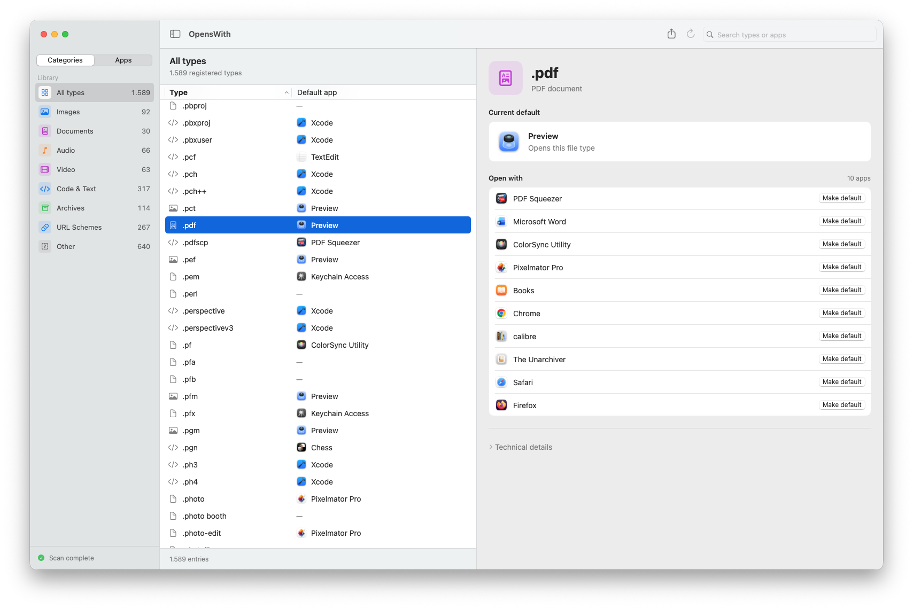
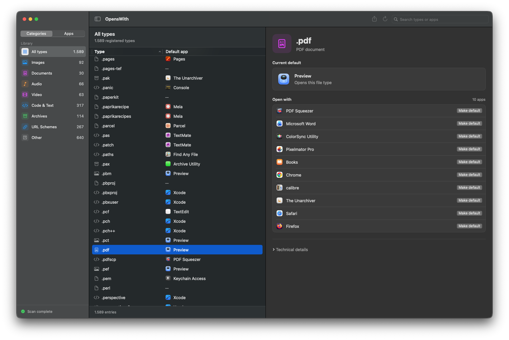
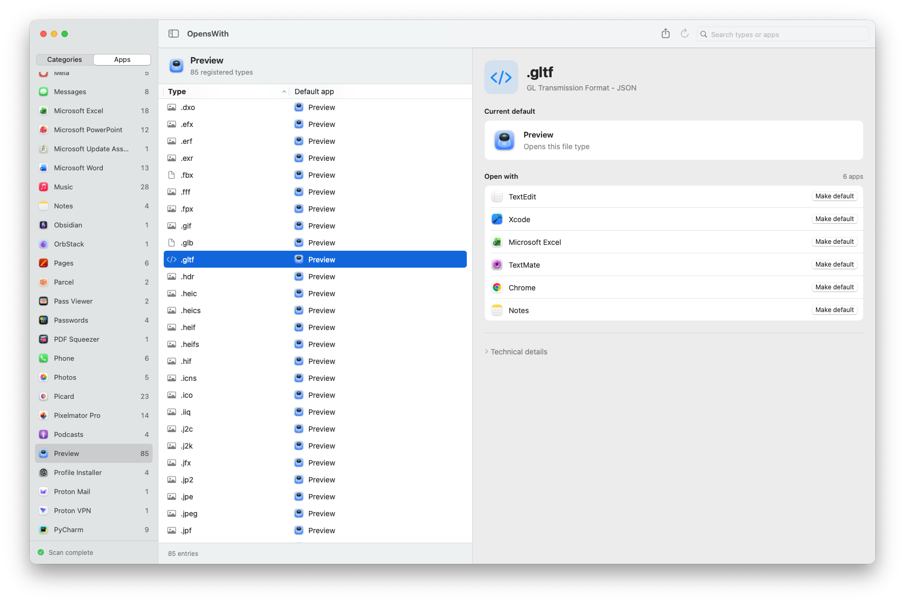
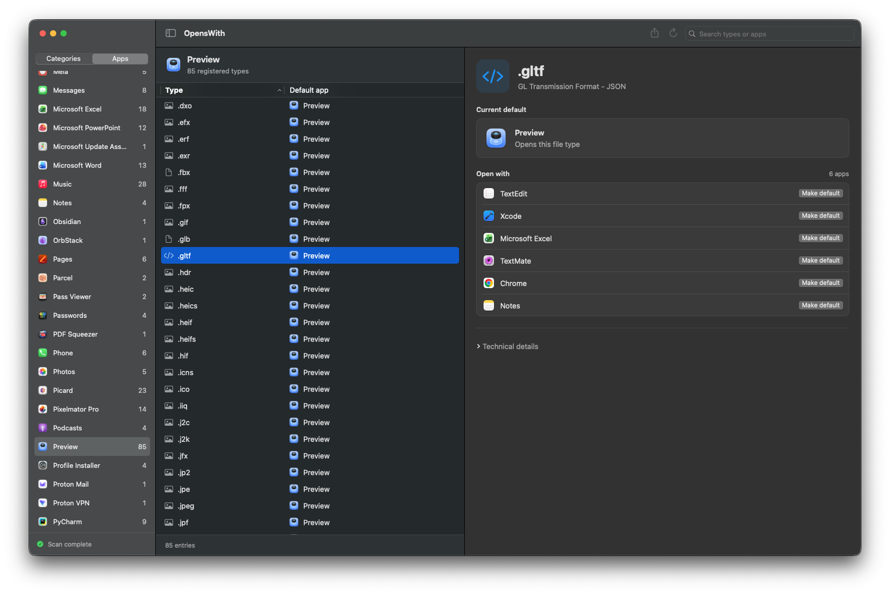

# OpensWith

> Audit which app opens what on your Mac.

A small native SwiftUI utility that lists every file extension and URL scheme registered on your system and tells you **which app opens which extension**.


[](https://www.savethechildren.net/)



This app is free and open source, and will stay that way. If you find it useful, please consider [donating to Save the Children](https://www.savethechildren.net/).

## Download

Grab the latest `.zip` from the [Releases page](https://github.com/giusepic/openswith/releases).

**Requirements for the download:** Apple silicon Mac (M1 or later), macOS 13 or newer. The packaged app does not support Intel Macs.

1. Download `OpensWith.zip` from the latest release.
2. Unzip and drag `OpensWith.app` to `/Applications`.
3. Open it.

The app is signed and notarized by Apple, so it opens normally on first launch.

## Features

- Lists every file extension and URL scheme any installed app has claimed.
- Shows the current default opener for each, plus the full list of alternatives.
- **Change the default** from the detail pane - click **Make default** on any alternative.
- **Shared types** - macOS stores defaults per content type, not per extension, so changing `.jpg` also changes `.jpeg`.
- Two browsing modes, switchable via a segmented control above the sidebar:
  - **Categories** — sidebar groups extensions by kind (Images, Documents, Code, Archives, URL schemes, …) with counts. Answers *"which app opens `.pdf`?"*
  - **Apps** — sidebar lists every app that's the registered default for at least one extension or scheme; sortable by name or count. Answers *"what does Preview own?"*
- Search and sort.
- **Export to CSV**
- No special permissions and no network access - the only exception is the update check for a new version.

## Build from source

**Requirements:** macOS 13+ and a Swift toolchain.

```bash
git clone https://github.com/giusepic/openswith.git
cd openswith
swift run OpensWith
```

Command Line Tools (`xcode-select --install`, ~1.5 GB) is enough for `swift build` and `swift run`. **Full Xcode is only needed for `swift test`** - XCTest currently only ships with Xcode.app, not Command Line Tools.

No third-party dependencies.

<details>
<summary>Build a distributable <code>.app</code></summary>

```bash
./scripts/make-app.sh
```

Produces `dist/OpensWith.app` and `dist/OpensWith.zip`. The script does a release build, wraps it in a proper bundle with `Distribution/Info.plist`, ad-hoc signs it, and zips it. Output is gitignored.

</details>

## How it works

The app reads the Launch Services database via the undocumented-but-stable `lsregister -dump` to enumerate every file extension and URL scheme any installed app has declared. For each extension it asks the system for the canonical UTI via `UTType(filenameExtension:)`, then queries `LSCopyDefaultApplicationURLForContentType` to find the current default. Extensions with no canonical UTI show as "Not assigned" rather than guessing from an app-private UTI. If `lsregister` ever stops working, the app says so explicitly rather than showing a partial list.

Changing a default goes through `NSWorkspace.setDefaultApplication`, which hands the request to Finder - that's where the system confirmation comes from. A successful callback doesn't guarantee the change took effect, so the app reads the value back and only reports success when the system agrees.

## License

MIT — see [LICENSE](LICENSE).

## Screenshots
<p align="center">
  
  <br>
  <sub><em>Browse by extension - light theme.</em></sub>
</p>

<p align="center">
  
  <br>
  <sub><em>Browse by extension - dark theme.</em></sub>
</p>

<p align="center">
  
  <br>
  <sub><em>Browse by app - light theme.</em></sub>
</p>

<p align="center">
  
  <br>
  <sub><em>Browse by app - dark theme.</em></sub>
</p>
